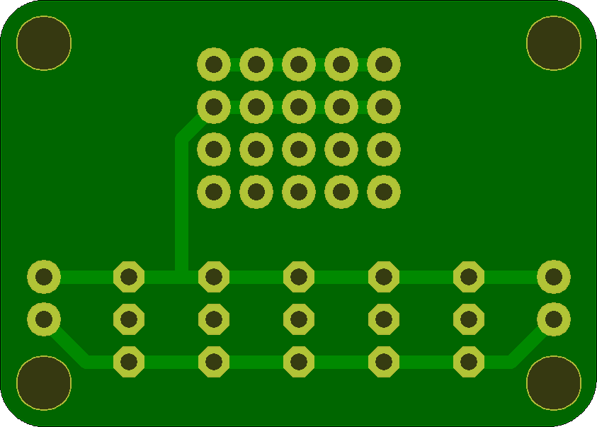
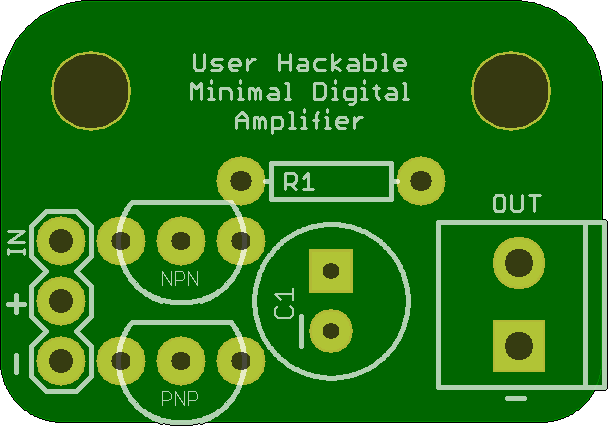

## Breakouts

A bunch of random breakout boards
## 4ButtonBreakout 

### Board dimensions

* (165000, 125000) original units
* (1.6500, 1.2500) inches
* (41.9100, 31.7500) mm

[gerbers](%*_gerber.zip)

| Front | Back |
| --- | --- |
|  |  |

## 5MMHexaStellaBreakout 

### Board dimensions

* (100000, 100000) original units
* (1.0000, 1.0000) inches
* (25.4000, 25.4000) mm

[gerbers](%*_gerber.zip)

| Front | Back |
| --- | --- |
|  |  |

## 5MMTetraStellaBreakout 

### Board dimensions

* (90000, 66245) original units
* (0.9000, 0.6624) inches
* (22.8600, 16.8262) mm

[gerbers](%*_gerber.zip)

| Front | Back |
| --- | --- |
|  |  |

## CharlieBreakout 

### Board dimensions

* (130000, 97500) original units
* (1.3000, 0.9750) inches
* (33.0200, 24.7650) mm

[gerbers](%*_gerber.zip)

| Front | Back |
| --- | --- |
|  |  |

## CharlieplexedLarsonScannerWandBreakout 

### Board dimensions

* (350000, 40000) original units
* (3.5000, 0.4000) inches
* (88.9000, 10.1600) mm

[gerbers](%*_gerber.zip)

| Front | Back |
| --- | --- |
|  |  |

## CharlieplexedPairReactorBreakout 

### Board dimensions

* (110000, 110000) original units
* (1.1000, 1.1000) inches
* (27.9400, 27.9400) mm

[gerbers](%*_gerber.zip)

| Front | Back |
| --- | --- |
|  |  |

## CharlieReactorBreakout 

### Board dimensions

* (110000, 110000) original units
* (1.1000, 1.1000) inches
* (27.9400, 27.9400) mm

[gerbers](%*_gerber.zip)

| Front | Back |
| --- | --- |
|  |  |

## FiveToggleBreakout 

### Board dimensions

* (140001, 99993) original units
* (1.4000, 0.9999) inches
* (35.5603, 25.3982) mm

[gerbers](%*_gerber.zip)

| Front | Back |
| --- | --- |
|  |  |

## Joystick 

### Board dimensions

* (110000, 125000) original units
* (1.1000, 1.2500) inches
* (27.9400, 31.7500) mm

[gerbers](%*_gerber.zip)

| Front | Back |
| --- | --- |
|  |  |

## Led_Bar 

### Board dimensions

* (150000, 45000) original units
* (1.5000, 0.4500) inches
* (38.1000, 11.4300) mm

[gerbers](%*_gerber.zip)

| Front | Back |
| --- | --- |
|  |  |

## LedBreakout2 

### Board dimensions

* (80000, 50000) original units
* (0.8000, 0.5000) inches
* (20.3200, 12.7000) mm

[gerbers](%*_gerber.zip)

| Front | Back |
| --- | --- |
|  |  |

## LedBreakout 

### Board dimensions

* (80000, 50000) original units
* (0.8000, 0.5000) inches
* (20.3200, 12.7000) mm

[gerbers](%*_gerber.zip)

| Front | Back |
| --- | --- |
|  |  |

## MinimalDigitalAmp 

### Board dimensions

* (100000, 69994) original units
* (1.0000, 0.6999) inches
* (25.4000, 17.7785) mm

[gerbers](%*_gerber.zip)

| Front | Back |
| --- | --- |
|  |  |

## Oval_RGB_Breakout 

### Board dimensions

* (65000, 60000) original units
* (0.6500, 0.6000) inches
* (16.5100, 15.2400) mm

[gerbers](%*_gerber.zip)

| Front | Back |
| --- | --- |
|  |  |

## RGB2Breakout 

### Board dimensions

* (80000, 50000) original units
* (0.8000, 0.5000) inches
* (20.3200, 12.7000) mm

[gerbers](%*_gerber.zip)

| Front | Back |
| --- | --- |
|  |  |

## RGBBreakout 

### Board dimensions

* (60000, 60000) original units
* (0.6000, 0.6000) inches
* (15.2400, 15.2400) mm

[gerbers](%*_gerber.zip)

| Front | Back |
| --- | --- |
|  |  |

## SingleToggleBreakout 

### Board dimensions

* (60000, 64993) original units
* (0.6000, 0.6499) inches
* (15.2400, 16.5082) mm

[gerbers](%*_gerber.zip)

| Front | Back |
| --- | --- |
|  |  |

## UsbA 

### Board dimensions

* (99951, 47461) original units
* (0.9995, 0.4746) inches
* (25.3876, 12.0551) mm

[gerbers](%*_gerber.zip)

| Front | Back |
| --- | --- |
|  |  |

## USBMiniBPower 

### Board dimensions

* (70000, 50000) original units
* (0.7000, 0.5000) inches
* (17.7800, 12.7000) mm

[gerbers](%*_gerber.zip)

| Front | Back |
| --- | --- |
|  |  |

